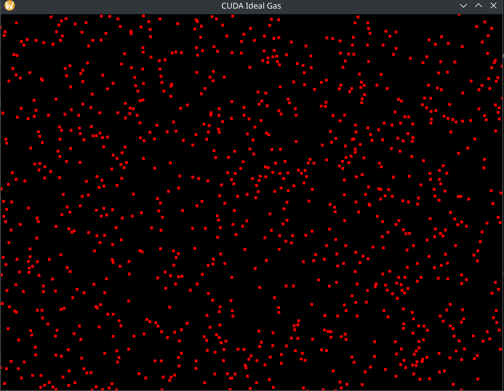

# CUDA Particles in a Box

This is a real-time GPU-accelerated simulation of thousands of particles bouncing inside a 2D box. Particles obey elastic collisions (ideal gas behavior) and bounce off each other and the walls without losing speed.



## 🧠 Features

- CUDA kernel for particle motion and elastic collisions  
- OpenGL rendering for real-time visualization  
- Elastic particle-particle and particle-wall collisions  
- Simulates simple ideal gas behavior  
- Highly parallelized using CUDA threads

## 🛠️ Requirements

- CUDA Toolkit (11.0 or later)
- OpenGL (via GLEW and GLFW)
- C++17-compatible compiler

## 🚀 Build Instructions

### 1. Clone this repository

```
git clone https://github.com/maurodeluca/particles-in-a-box-gpu
cd particles-in-a-box-gpu
```

### 2. Compile with `nvcc`

```
nvcc -o build/particles particle_in_a_box_visual_gpu.cu -arch=native -lGL -lGLU -lglfw -lGLEW -Wno-deprecated-gpu-targets
```

> **Notes:** On Linux, you may need:
> ```
> sudo apt install libglfw3-dev libglew-dev
> ```

### 3. Run the simulation

```
./particles
```

## 🎮 Controls

No keyboard or mouse input required — particles move and collide automatically.

## 📖 Theory

This simulation demonstrates a basic **ideal gas** system:

- Particles behave like hard spheres.
- Collisions conserve momentum and kinetic energy.
- No long-range forces or energy loss.
- Useful for visualizing thermodynamic concepts.

## 📄 License

MIT License — you are free to use, modify, and distribute this code.

---

Made with ❤️ using CUDA and OpenGL.
